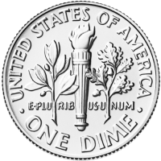
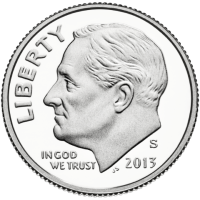
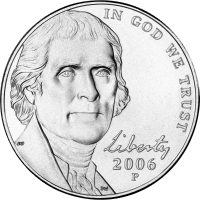
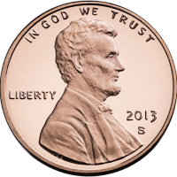
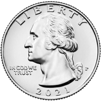

# OS5
Mesuaring Specific Objects


## Design


### Coins
```["DimeBack.png,"DimeFront.png","HalfBack.png","HalfFront.png","NickelBack.png","NickelFront.png","PennyBack.png","PennyFront.png","QuarterBack.png","QuarterFront.png"]```

            
     
     
     


### Mesearing objects
#### Light
```["baloon.png","clip.png","feather.png","flower.png","leaf.png","needle.png","paper.png","snowflake.png"]```

                


#### Heavy
```["anchor.png","barrel.png","dumbell.png","luggage.png","safe.png","toolbox.png","truck-front.png","weight.png"]```  

                


#### High
```["crane.png","giraffe.png","lighthouse.png","mountain.png","roller-coaster.png","skyscrapers.png","tree.png","water-tower.png"]```   

                  


#### Low
```["book.png","bucket.png","bush.png","cup.png","grass.png","rubber.png","stem-flower.png","toy.png"]```  

                  

