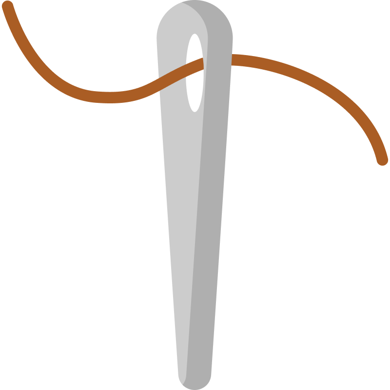
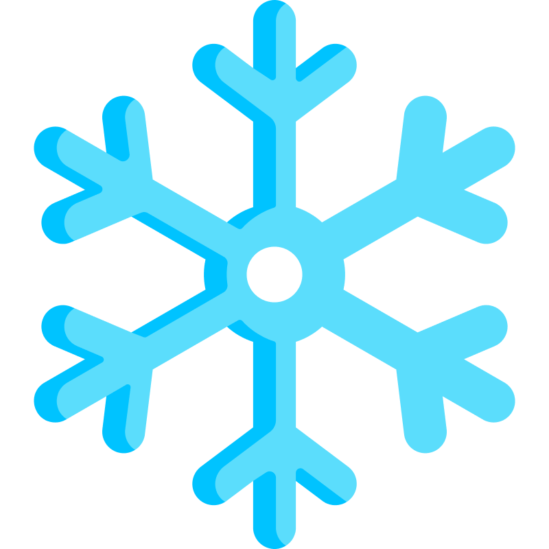
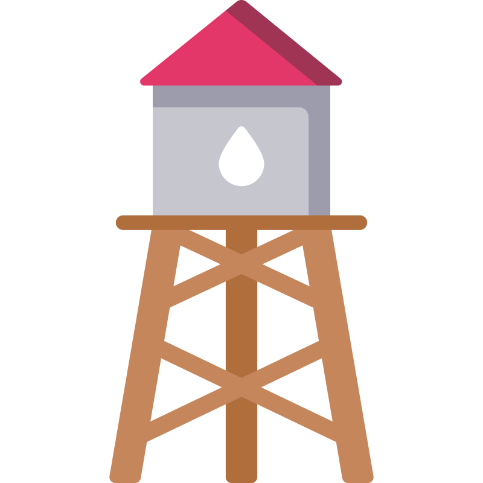
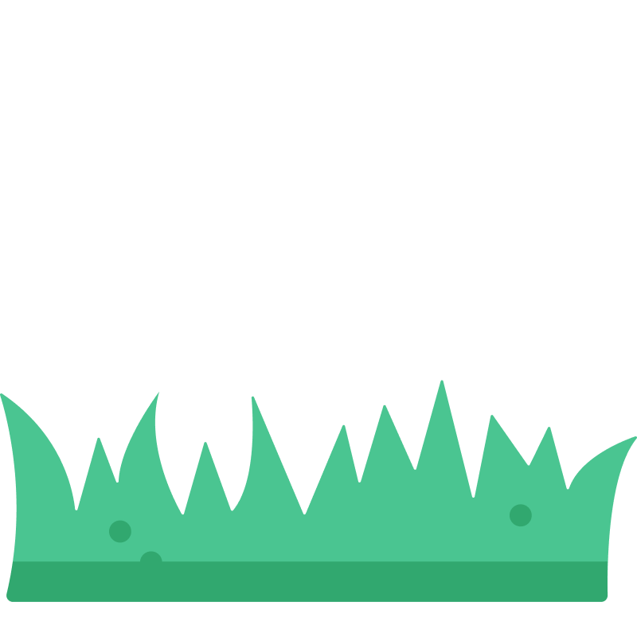

# OS5
Mesuaring Specific Objects


## Design


## Parameters
```t=["type"]```

* type - string in folowing lists (coins, light, heavy, tall, short)


### Coins
```["dime-back.png,"dime-front.png","half-back.png","half-front.png","nickel-back.png","nickel-front.png","penny-back.png","penny-front.png","quarter-back.png","quarter-front.png"]```

            
     
     
     


### Mesearing objects
#### Light
```["baloon.png","clip.png","feather.png","flower.png","leaf.png","needle.png","paper.png","snowflake.png"]```

                


#### Heavy
```["anchor.png","barrel.png","dumbell.png","luggage.png","safe.png","toolbox.png","truck-front.png","weight.png"]```  

                


#### Tall
```["crane.png","giraffe.png","lighthouse.png","mountain.png","roller-coaster.png","skyscrapers.png","tree.png","water-tower.png"]```   

                  


#### Short
```["book.png","bucket.png","bush.png","cup.png","grass.png","rubber.png","stem-flower.png","toy.png"]```  

                  

