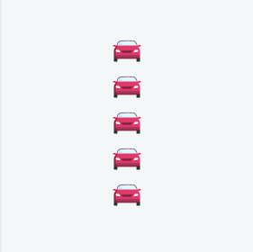

# OS 6
Structurisation of objects  


## Parameters:
```t=[num1,num2,"type"]```
* num1, num2 - integers from 1 to 10
* type - string : vertical, horisontal, diagonal, back-diagonal


## Options:
     
     
     
     

