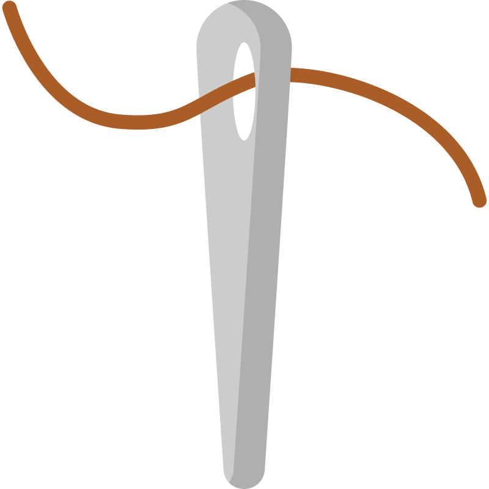
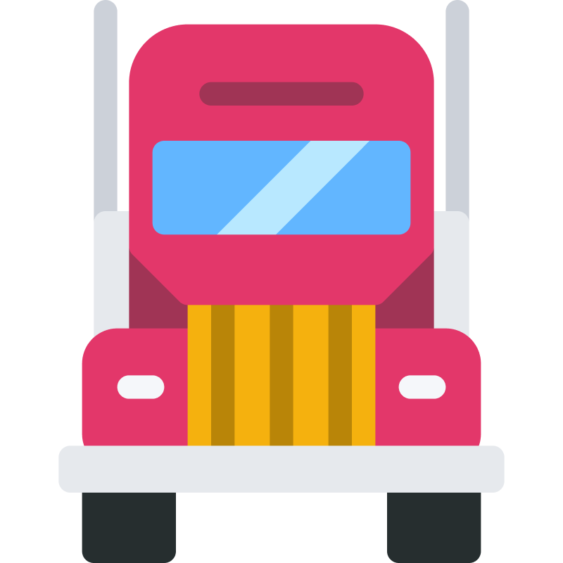
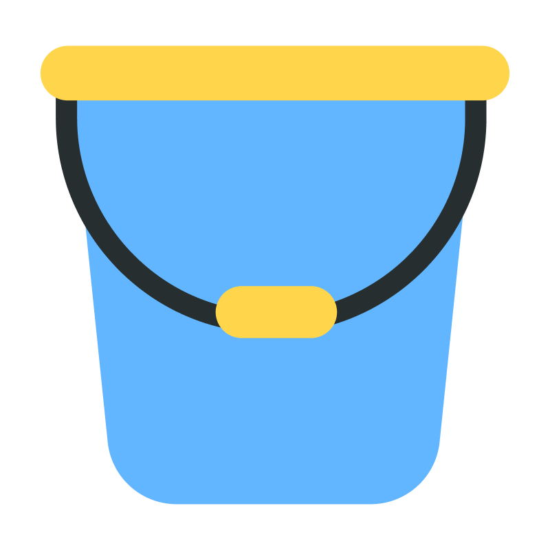

# SO3
Compare specific objects  

## Design


## Link
```https://innovations.kh.ua/images/formats/op/op4.php?t=["object1","object2"]```

* object1 - string from list.
* object2 - string from list.

### Light
```["baloon.png","clip.png","feather.png","flower.png","leaf.png","needle.png","paper.png","snowflake.png"]```

                


### Heavy
```["anchor.png","barrel.png","dumbell.png","luggage.png","safe.png","toolbox.png","truck-front.png","weight.png"]```  

                


### High
```["crane.png","giraffe.png","lighthouse.png","mountain.png","roller-coaster.png","skyscrapers.png","tree.png","water-tower.png"]```   

                  


### Low
```["book.png","bucket.png","bush.png","cup.png","grass.png","rubber.png","stem-flower.png","toy.png"]```  

                  

## Relate objects 

### Light
```["baloon.png","feather.png","flower.png","leaf.png","needle.png","paper.png","snowflake.png"]```

                


### Heavy
```["anchor.png","barrel.png","safe.png","weight.png"]```  

        


### High
```["evergreen-tree.png","lighthouse.png","mountain.png","palmtree.png","roller-coaster.png","tree.png","water-tower.png"]```   

              


### Low
```["cup.png","grass.png","stem-flower.png"]```  

     


