# Робота із картинками
## Загальний опис.
**Основні джерела даних:**
- Робота Євгена (figma)
- Картинки в папці assets/images та підпапках із назвами розмірів (зараз flat96, flat440).
- Масив $names в файлі config.php.
- обмеження для AI на генерацію назв зображень

**Оновні вимоги:**
- всі джерела мають мати однакову структуру
- зміни, які відбуваються мають оновлюватися у всіх джерелах даних (необхідний процес)
- головним джерелом даних для технічної роботи є масив $names, який необхідно підтримувати у відповідності із файлами figma.

## Приклади файлів Figma та ропоновані зміни:
### Acitivites
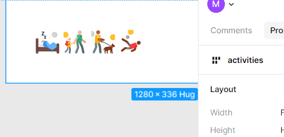   
  
### animals
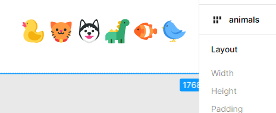  

### coins
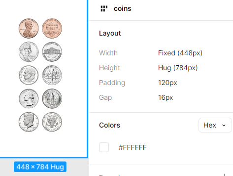   
  
### delete
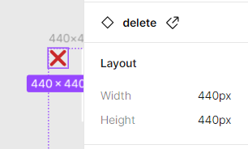  

**Comments:**  
Цей розділ не існує як розділ, проте зображення "хрестик" для видалення винесено окремо

**Proposal:**  
Зроити в Figma окремий розділ delete.

### dots
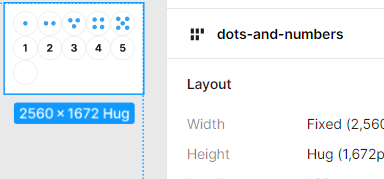   

**Comments:**  
В Figma названий як dots and numbers
  
**Proposal:**  
Назву в Figme змінити на dots, адже у відповідному ресурсі числа зроблені числами, а не картинками. 

### fruits-vegitables
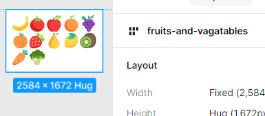  

### heavy
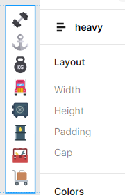   
  
### items
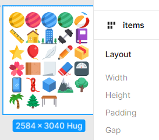  

**Comments:**  
Зараз в розділі items в Figma немає об'єкту ball (є ball-beach)
  
**Proposal:**  
Зробити окремий об'єкт ball, або замінити назву ball-beach на ball.

### lights
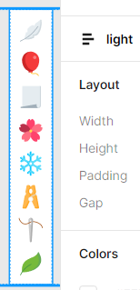   
  
### shapes-elemets
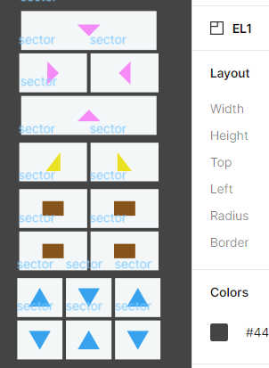  

**Comments:**  
В Figma немає окремого блоку із даними зображеннями в блоці, де винесені всі зображення. Дані зображення реалізовані лише в ресурсі EL1. 

**Proposal:**  
Зробити окремий блок shapes-elements.

### shapes
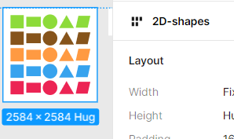    

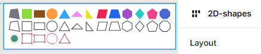    

    

**Comments:**  
В масиві $names категорія має назву shapes.

**Proposal:**  
Змінити назву на 2d-shapes, а 3-вимірні картинки розмістити в папці 3d-shapes.

### short
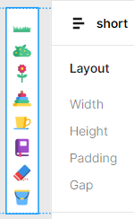   
  
### sweets
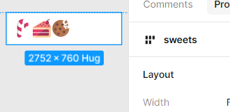  

### tall
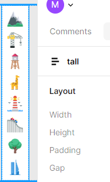   
  
### ten-blocks
  

**Comments:**  
Зараз не використовується (блоки відмальовуються програмно). І в Figma - немає окремого блока (зроблено в ресурсі BT1)

**Proposal:**  
Видалити

### vechiles
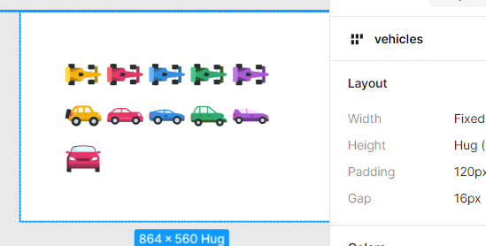  

**Comments:** 
Зараз в Figma звичайна червона машина називається car-front.

**Proposal:**  
Змінити назву в Figma на car

## Робота ресурсів із картинками.
Всього є 3 основних типів роботи із картинками:
* назва картинки передається в параметрі, і далі за допомогою функцій findGroupName або find_group_name, які є еквівалентними за результатом знаходиться категорія, я якій розміщений даний файл (відповідний елемент-масив в масиві $names) і вже від цього генерується шлях до картинки. 
* навза картинки не передається в параметрі (наприклад, в ресурсі EL1) або вона складена і її треба опрацювати (як в ресурсі SH1) 
* "Технічні картинки" - арифметичні дії (OP4, OP5, OP6, OP7), картинка-закреслення (OP2), типовий елемент (BT2, BT3, SO3). Такі картинки визначаються самим ресурсом 
    
Відповідно до цього - перенесення картинки з папки в папку не впливає на її достумність за параметром для ресурсів.  

<a href = "https://docs.google.com/spreadsheets/d/1UpcoQVKg4PVw1gaGaDU-OYEiMlAzzfeiJ0V1jwOeVLs/edit?gid=0#gid=0">Файл із описом використання картинок ресурсами</a>

